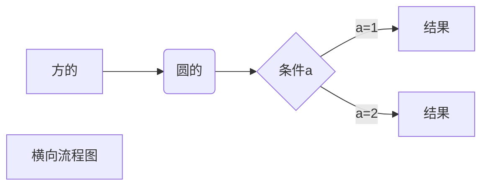
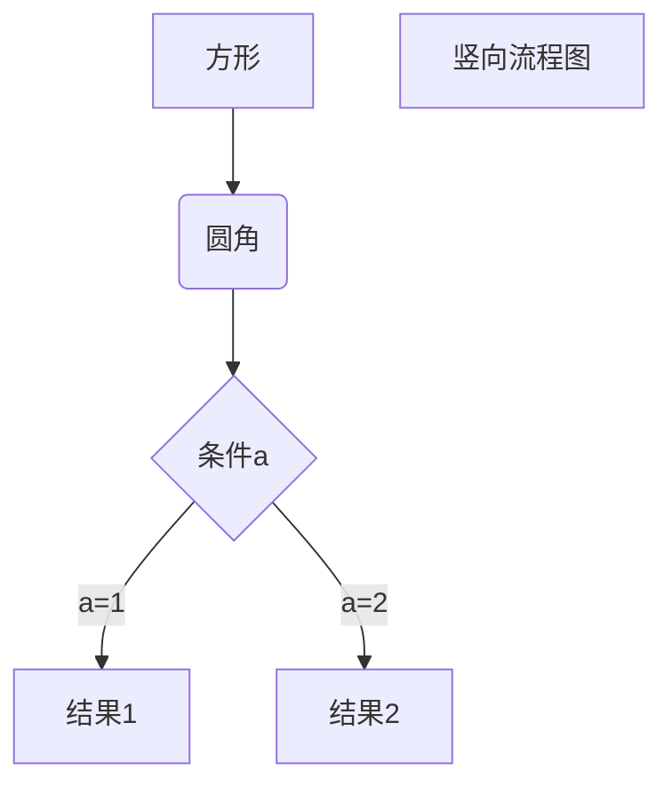
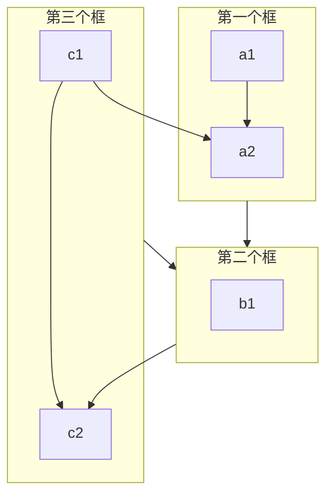
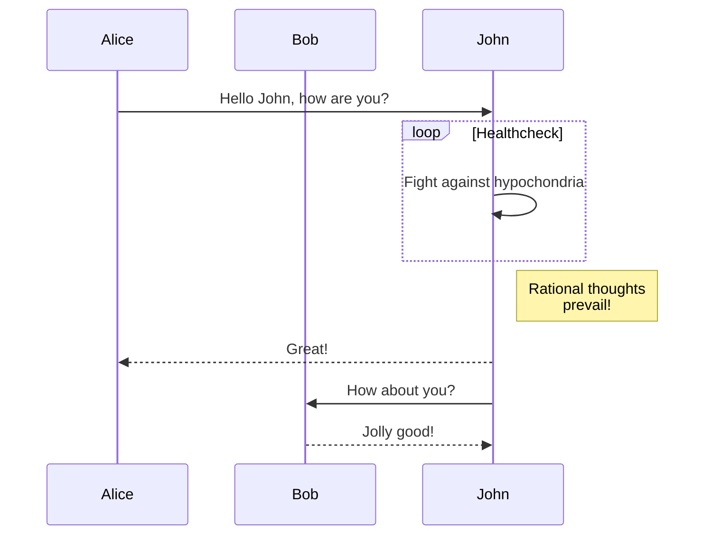
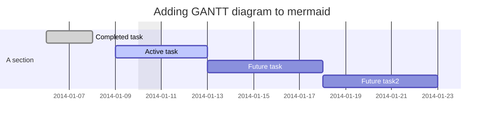
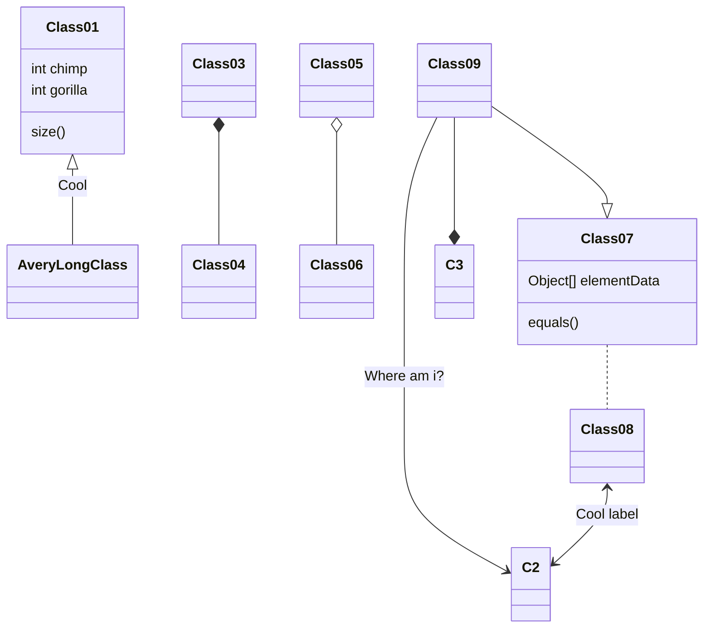
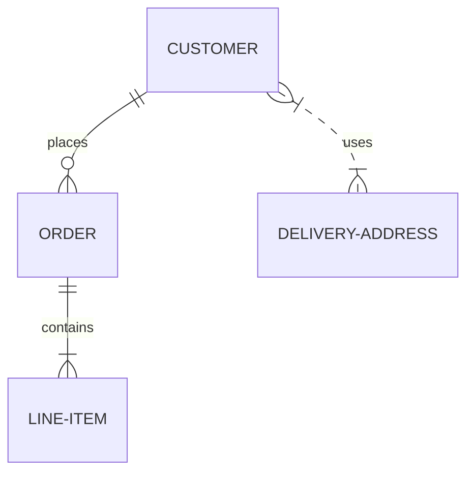
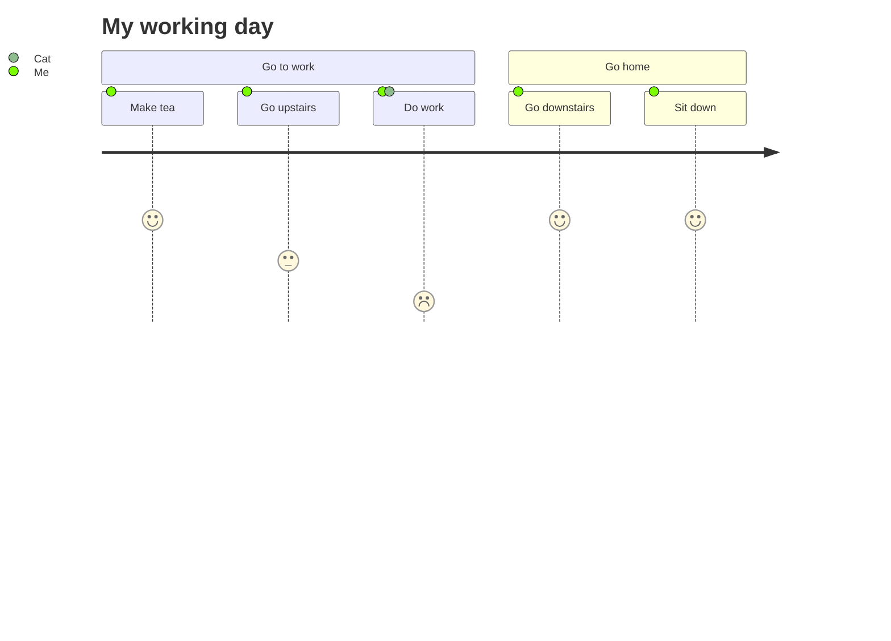
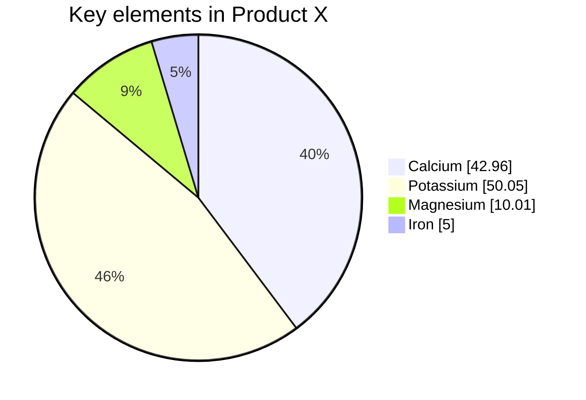

# 一级标题   
[主题](https://vscodethemes.com/)
## 二级标题
*斜体*
_斜体_
**粗体**
***粗斜体***
分行
***
- - - 
~~删除~~
<u>下划线</u>
[^脚注]：这样
- - -
- 第一
- 第二
* 第一
* 第二
- - -
1. 第一
2. 第二
- - - 
3. 第一
   - 嵌套
- - - 
> 区块
> > 嵌套区块
> > > 再嵌套区块
- - - 
> 区块中列表
> 1. 第一
> 2. 第二
- - -
- 列表中区块
  > 区块
- - -
`引用高亮`
```java
代码块
```
- - -
[链接名](地址)
<https://www.runoob.com>
高级链接 1 作为变量 [Runoob][1]

[1]: https://www.runoob.com
- - -


也可以用 2 作为变量 [Runoob][2].

[2]: http://static.runoob.com/images/runoob-logo.png

指定高度与宽度

- - -
|第一个表头|第二个表头|
| ---- |----|
|单元格|单元格|
- - -
|左对齐|右对齐|居中对齐|
|:---|--:|:--:|
|单元格|单元格|单元格|
- - -
<kbd>方框</kbd>
\*\* 转义 \*\*
- - -
公式
$f(x)=sin(x)+12$
$$\sum_{n=1}^{100} n$$
$\begin{matrix}
    a & b \\
    c & d
\end{matrix}$
$$\begin{matrix}
    a & b \\
    c & d
\end{matrix}$$
- - -
[mermaid](https://mermaid-js.github.io/mermaid/#/)



> * TB - top to bottom
> * TD - top-down/ same as top to bottom
> * BT - bottom to top
> * RL - right to left
> * LR - left to right

[**flowcharts**](https://mermaid-js.github.io/mermaid/#/flowchart?id=special-characters-that-break-syntax)

[**Sepuence diagram**](https://mermaid-js.github.io/mermaid/#/sequenceDiagram?id=syntax)








test
test